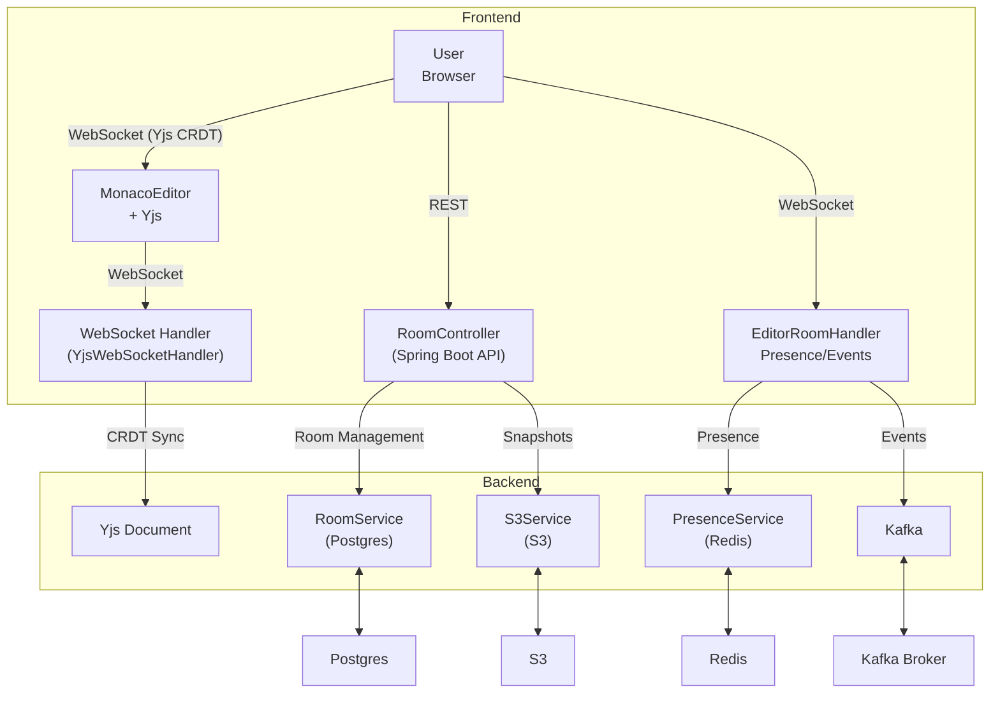

# CodeShare

A real-time collaborative code editor designed for teams and individuals. It enables seamless multi-user editing with live cursor sharing, in-room chat, and room management. Built for performance and scalability, CodeShare supports version history, presence tracking, and a modern developer experience.

---

## Architecture

---

## System Overview

Real-time collaborative code editing is enabled using Yjs, a CRDT-based library that merges changes without central coordination. The frontend communicates with the backend through WebSocket connections for live sync and user presence updates. User presence is tracked using Redis and broadcast to all connected clients in a room. Room creation, joining, and history are handled through REST API endpoints. To maintain a version history, code snapshots are periodically stored in S3. Editor events are streamed using Kafka, allowing for scalable event processing. All room and user metadata is stored in a PostgreSQL database.

---

## Features

- Real-time collaborative code editing with CRDT and Yjs
- Create/join code rooms
- Live user presence and cursor overlays
- In-room chat
- Version history and snapshots
- Secure JWT authentication
- Dashboard for managing rooms
- Admin metrics with Prometheus/Grafana
- Responsive, modern UI with Next.js & Tailwind
- Skeleton loading states for better UX

---

## Tech Stack

- **Frontend:** Next.js, React, Redux Toolkit, Tailwind CSS, Monaco Editor, Yjs, y-monaco, y-websocket
- **Backend:** Spring Boot, WebSocket, Kafka, Redis, S3, Postgres
- **DevOps:** Docker, Docker Compose, Prometheus, Grafana
