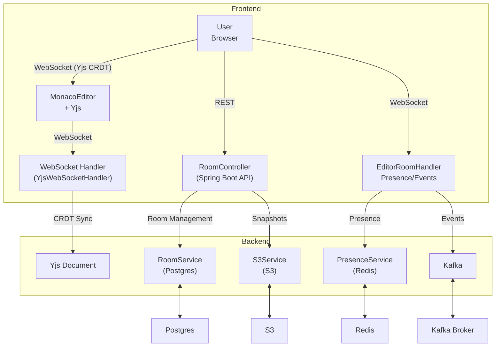

# CodeShare

A real-time collaborative code editor designed for teams and individuals. Enables seamless multi-user editing with live cursor sharing, presence tracking, and room management. Built for performance and scalability, CodeShare supports version history, secure authentication, and a modern developer experience.

## Architecture



---

## System Overview

Real-time collaborative code editing is enabled using Yjs, a CRDT-based library that merges changes without central coordination. The frontend communicates with the backend through WebSocket connections for live sync and user presence updates. User presence is tracked using Redis and broadcast to all connected clients in a room. Room creation, joining, and history are handled through REST API endpoints. To maintain a version history, code snapshots are periodically stored in S3. Editor events are streamed using Kafka, allowing for scalable event processing. All room and user metadata is stored in AWS RDS. Deployed on AWS Fargate.

---

## Features

- Real-time collaborative code editing with CRDT and Yjs
- Create/join code rooms
- Live user presence and cursor overlays
- In-room chat
- Version history and snapshots
- Secure JWT authentication
- Dashboard for managing rooms
- Admin metrics with Prometheus/Grafana
- Responsive, modern UI with Next.js & Tailwind
- Skeleton loading states for better UX

---

## Quick Start

Get CodeShare running locally in 2 commands:

```bash
# 1. Clone and start all services
git clone https://github.com/sarihammad/codeshare
cd codeshare
docker compose up --build

# 2. Access the application
# Frontend: http://localhost:3000
# Backend API: http://localhost:8080
# Prometheus: http://localhost:9090
```

## Why This Project is Interesting

**Technical Innovation:**
- **CRDT-based Collaboration**: Uses Yjs for conflict-free real-time editing without central coordination
- **Multi-Protocol Architecture**: Combines WebSocket (Yjs), REST APIs, and Kafka for different use cases
- **Production-Ready Security**: JWT authentication, rate limiting, CORS, and secure cookies
- **Observability-First**: Custom Prometheus metrics, structured JSON logs, and OpenTelemetry tracing

**Product Value:**
- **Developer Experience**: Monaco Editor with syntax highlighting, IntelliSense, and collaborative features
- **Real-time Presence**: See who's editing, where their cursor is, and get live updates
- **Version Control**: Automatic snapshots and history tracking for collaborative sessions
- **Scalable Architecture**: Designed to handle multiple concurrent editing sessions

---

## Tech Stack

- **Frontend:** Next.js 15, React 19, Redux Toolkit, Tailwind CSS, Monaco Editor, Yjs, y-monaco, y-websocket
- **Backend:** Spring Boot 3.5, WebSocket, Kafka, Redis, S3, PostgreSQL, Flyway
- **Security:** JWT authentication, rate limiting (Bucket4j), CORS, secure cookies
- **Observability:** Prometheus metrics, structured JSON logs, OpenTelemetry tracing
- **DevOps:** Docker, Docker Compose, health checks, multi-stage builds
- **Testing:** Vitest, React Testing Library, Playwright, JUnit 5
