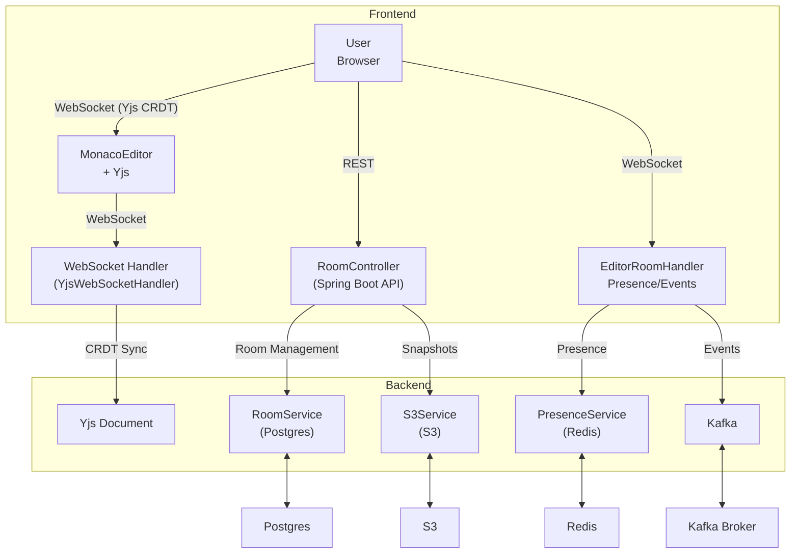

# CodeShare

A real-time collaborative code editor designed for teams and individuals. It enables seamless multi-user editing with live cursor sharing, presence tracking, and room management. Built for performance and scalability, CodeShare supports version history, secure authentication, and a modern developer experience.

## 🚀 Quick Start

Get CodeShare running locally in 2 commands:

```bash
# 1. Clone and start all services
git clone <repository-url>
cd codeshare
docker compose up --build

# 2. Access the application
# Frontend: http://localhost:3000
# Backend API: http://localhost:8080
# Prometheus: http://localhost:9090
```

## 🎯 Why This Project is Interesting

**Technical Innovation:**

- **CRDT-based Collaboration**: Uses Yjs for conflict-free real-time editing without central coordination
- **Multi-Protocol Architecture**: Combines WebSocket (Yjs), REST APIs, and Kafka for different use cases
- **Production-Ready Security**: JWT authentication, rate limiting, CORS, and secure cookies
- **Observability-First**: Custom Prometheus metrics, structured JSON logs, and OpenTelemetry tracing

**Product Value:**

- **Developer Experience**: Monaco Editor with syntax highlighting, IntelliSense, and collaborative features
- **Real-time Presence**: See who's editing, where their cursor is, and get live updates
- **Version Control**: Automatic snapshots and history tracking for collaborative sessions
- **Scalable Architecture**: Designed to handle multiple concurrent editing sessions

---

## Architecture



---

## System Overview

Real-time collaborative code editing is enabled using Yjs, a CRDT-based library that merges changes without central coordination. The frontend communicates with the backend through WebSocket connections for live sync and user presence updates. User presence is tracked using Redis and broadcast to all connected clients in a room. Room creation, joining, and history are handled through REST API endpoints. To maintain a version history, code snapshots are periodically stored in S3. Editor events are streamed using Kafka, allowing for scalable event processing. All room and user metadata is stored in a PostgreSQL database.

---

## Features

- Real-time collaborative code editing with CRDT and Yjs
- Create/join code rooms
- Live user presence and cursor overlays
- In-room chat
- Version history and snapshots
- Secure JWT authentication
- Dashboard for managing rooms
- Admin metrics with Prometheus/Grafana
- Responsive, modern UI with Next.js & Tailwind
- Skeleton loading states for better UX

---

## 🔧 Environment Configuration

Copy `.env.example` to `.env` and configure the following variables:

| Variable          | Description                       | Default                                      | Required |
| ----------------- | --------------------------------- | -------------------------------------------- | -------- |
| `DB_URL`          | PostgreSQL connection URL         | `jdbc:postgresql://localhost:5432/codeshare` | ✅       |
| `DB_USER`         | Database username                 | `postgres`                                   | ✅       |
| `DB_PASSWORD`     | Database password                 | -                                            | ✅       |
| `JWT_SECRET`      | JWT signing secret (min 32 chars) | -                                            | ✅       |
| `JWT_EXPIRATION`  | Token expiration in milliseconds  | `86400000`                                   | ❌       |
| `REDIS_HOST`      | Redis host                        | `localhost`                                  | ❌       |
| `REDIS_PORT`      | Redis port                        | `6379`                                       | ❌       |
| `KAFKA_BOOTSTRAP` | Kafka bootstrap servers           | `localhost:9092`                             | ❌       |
| `FRONTEND_ORIGIN` | Allowed CORS origin               | `http://localhost:3000`                      | ❌       |
| `COOKIE_SECURE`   | Use secure cookies (HTTPS)        | `false`                                      | ❌       |
| `S3_ENABLED`      | Enable S3 for snapshots           | `false`                                      | ❌       |
| `S3_BUCKET`       | S3 bucket name                    | `codeshare-bucket`                           | ❌       |
| `S3_REGION`       | AWS region                        | `us-east-1`                                  | ❌       |

## 🏗️ Tech Stack

- **Frontend:** Next.js 15, React 19, Redux Toolkit, Tailwind CSS, Monaco Editor, Yjs, y-monaco, y-websocket
- **Backend:** Spring Boot 3.5, WebSocket, Kafka, Redis, S3, PostgreSQL, Flyway
- **Security:** JWT authentication, rate limiting (Bucket4j), CORS, secure cookies
- **Observability:** Prometheus metrics, structured JSON logs, OpenTelemetry tracing
- **DevOps:** Docker, Docker Compose, health checks, multi-stage builds
- **Testing:** Vitest, React Testing Library, Playwright, JUnit 5

## 🚀 Deployment

### Local Development

```bash
# Start all services with Docker Compose
docker compose up --build

# Or run services individually
cd backend && ./mvnw spring-boot:run
cd frontend && npm run dev
```

### Production Deployment

1. **Set Environment Variables:**

   ```bash
   export JWT_SECRET="your-secure-secret-key"
   export DB_PASSWORD="your-db-password"
   export COOKIE_SECURE="true"
   export FRONTEND_ORIGIN="https://your-domain.com"
   ```

2. **Deploy with Docker Compose:**

   ```bash
   docker compose -f docker-compose.yml -f docker-compose.prod.yml up -d
   ```

3. **Health Checks:**

   ```bash
   # Check service health
   curl http://localhost:8080/actuator/health
   curl http://localhost:3000/api/health

   # View metrics
   curl http://localhost:8080/actuator/prometheus
   ```

## 🧪 Testing

```bash
# Frontend tests
cd frontend
npm test                    # Unit tests
npm run test:watch         # Watch mode
npm run e2e                # End-to-end tests

# Backend tests
cd backend
./mvnw test                # Unit tests
./mvnw verify              # Integration tests
```

## 📊 Monitoring & Observability

- **Metrics:** Available at `/actuator/prometheus`
- **Health:** Available at `/actuator/health`
- **Logs:** Structured JSON logs in production
- **Tracing:** OpenTelemetry with Zipkin integration

## 🔒 Security Features

- JWT-based authentication with secure httpOnly cookies
- Rate limiting on authentication endpoints
- CORS configuration with environment-based origins
- Input validation with Bean Validation
- Non-root Docker containers
- Secrets externalized to environment variables

## 🐛 Troubleshooting

### Common Issues

1. **WebSocket Connection Failed:**

   - Check if backend is running on port 8080
   - Verify CORS configuration
   - Check browser console for errors

2. **Database Connection Issues:**

   - Ensure PostgreSQL is running
   - Check database credentials in `.env`
   - Verify Flyway migrations completed

3. **Frontend Build Issues:**
   - Clear node_modules: `rm -rf node_modules && npm install`
   - Check Node.js version (18+ required)
   - Verify environment variables

### Logs

```bash
# View application logs
docker compose logs -f backend
docker compose logs -f frontend

# View specific service logs
docker compose logs -f postgres
docker compose logs -f redis
```

## 🤝 Contributing

1. Fork the repository
2. Create a feature branch: `git checkout -b feature/amazing-feature`
3. Commit changes: `git commit -m 'Add amazing feature'`
4. Push to branch: `git push origin feature/amazing-feature`
5. Open a Pull Request

## 📄 License

This project is licensed under the MIT License - see the [LICENSE](LICENSE) file for details.
