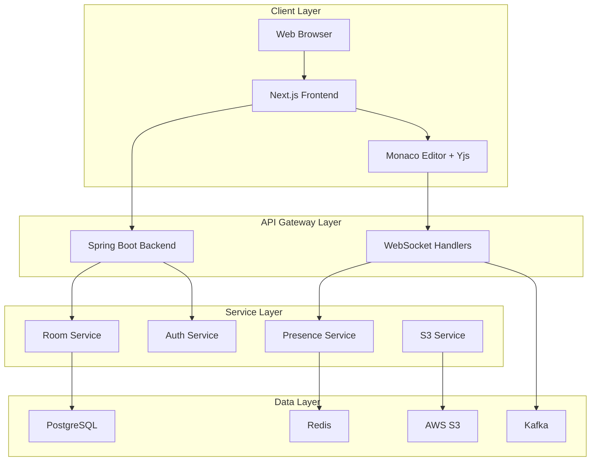
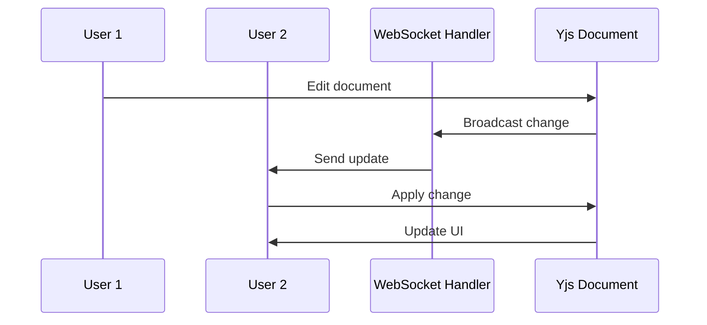
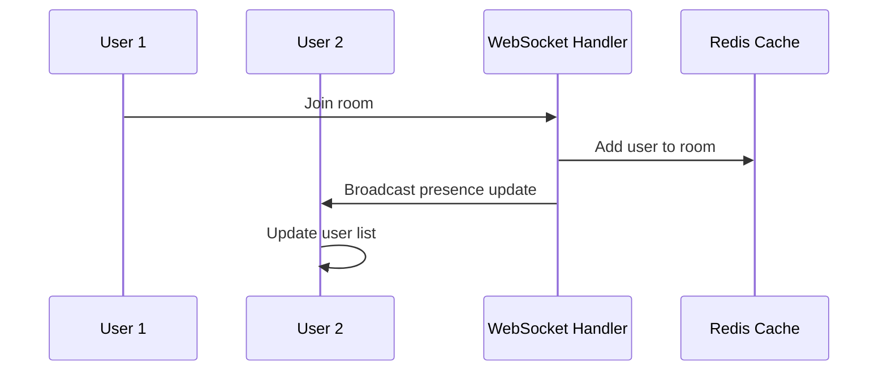
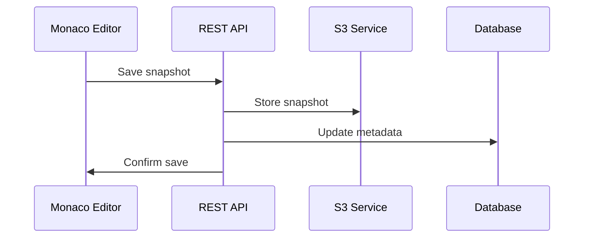

# CodeShare Architecture

## Overview

CodeShare is a real-time collaborative code editor built with a microservices architecture. It uses CRDTs (Conflict-free Replicated Data Types) for real-time collaboration, ensuring that multiple users can edit the same document simultaneously without conflicts.

## System Architecture

### High-Level Architecture



## Component Details

### Frontend Architecture

#### Next.js Application

- **Framework**: Next.js 15 with App Router
- **State Management**: Redux Toolkit for global state
- **Styling**: Tailwind CSS for utility-first styling
- **Editor**: Monaco Editor for code editing capabilities

#### Real-time Collaboration

- **CRDT Library**: Yjs for conflict-free collaborative editing
- **WebSocket Provider**: y-websocket for real-time synchronization
- **Monaco Integration**: y-monaco for Monaco Editor integration

#### Key Components

```
src/
├── app/                    # Next.js App Router pages
├── components/            # Reusable UI components
│   ├── MonacoEditor.tsx   # Main editor component
│   ├── UserList.tsx       # Presence display
│   └── Toast.tsx          # Notification system
├── config/                # Configuration files
├── hooks/                 # Custom React hooks
├── lib/                   # Utility libraries
├── services/              # API service layer
└── store/                 # Redux store configuration
```

### Backend Architecture

#### Spring Boot Application

- **Framework**: Spring Boot 3.5 with Java 21
- **Security**: Spring Security with JWT authentication
- **WebSocket**: Spring WebSocket for real-time communication
- **Validation**: Bean Validation for input validation

#### Domain-Driven Design

```
src/main/java/com/codeshare/
├── domain/                # Domain logic
│   ├── auth/             # Authentication domain
│   ├── room/             # Room management domain
│   ├── editor/           # Editor domain
│   └── user/             # User domain
├── infrastructure/        # Infrastructure concerns
│   ├── redis/            # Redis integration
│   ├── s3/               # S3 integration
│   ├── security/         # Security implementation
│   └── metrics/          # Metrics collection
├── web/                  # Web layer
│   └── controller/       # REST controllers
└── websocket/            # WebSocket handlers
```

#### Key Services

- **RoomService**: Manages room creation, joining, and metadata
- **AuthService**: Handles user authentication and JWT management
- **PresenceService**: Tracks user presence using Redis
- **S3Service**: Manages code snapshots and version history
- **MetricsService**: Collects application metrics for monitoring

### Data Architecture

#### PostgreSQL Database

- **Purpose**: Stores user accounts, room metadata, and relationships
- **Schema Management**: Flyway migrations for version control
- **Tables**:
  - `users`: User accounts and authentication data
  - `rooms`: Room metadata and ownership
  - `room_members`: Many-to-many relationship between users and rooms

#### Redis Cache

- **Purpose**: Real-time presence tracking and session management
- **Data Types**: Sets for room membership, Hash for user presence
- **TTL**: Automatic expiration for inactive users

#### AWS S3

- **Purpose**: Stores code snapshots and version history
- **Structure**: Organized by room ID with timestamped snapshots
- **Fallback**: Local storage for development environments

#### Kafka

- **Purpose**: Event streaming for editor changes and system events
- **Topics**: `editor-events` for real-time collaboration events
- **Consumer**: Future extensibility for analytics and notifications

## Real-time Collaboration Flow

### 1. Document Synchronization



### 2. Presence Tracking



### 3. Snapshot Management



## Security Architecture

### Authentication Flow

1. User submits credentials via REST API
2. Backend validates credentials against database
3. JWT token generated and stored in httpOnly cookie
4. Subsequent requests include JWT in cookie
5. WebSocket connections validate JWT during handshake

### Security Measures

- **JWT Authentication**: Stateless authentication with configurable expiration
- **Secure Cookies**: httpOnly, secure, and SameSite attributes
- **Rate Limiting**: Bucket4j for API endpoint protection
- **CORS**: Environment-based origin configuration
- **Input Validation**: Bean Validation on all request DTOs
- **Non-root Containers**: Docker containers run as non-privileged users

## Observability Architecture

### Metrics Collection

- **Prometheus**: Custom metrics for business logic
- **Micrometer**: Application metrics integration
- **Custom Metrics**:
  - `codeshare.rooms.active`: Current active rooms
  - `codeshare.websocket.connections.active`: Active WebSocket connections
  - `codeshare.snapshots.written`: Total snapshots written
  - `codeshare.rooms.created`: Total rooms created

### Logging Strategy

- **Structured Logging**: JSON format in production
- **Log Levels**: Configurable per component
- **Correlation IDs**: Request tracing across services
- **Log Aggregation**: Ready for ELK stack integration

### Tracing

- **OpenTelemetry**: Distributed tracing support
- **Zipkin Integration**: Trace visualization
- **Sampling**: Configurable sampling rates for production

## Scalability Considerations

### Horizontal Scaling

- **Stateless Backend**: JWT-based authentication enables horizontal scaling
- **Redis Clustering**: Presence service can be clustered
- **Database Sharding**: Room-based sharding strategy
- **Load Balancing**: WebSocket sticky sessions for real-time features

### Performance Optimizations

- **Connection Pooling**: Database and Redis connection pooling
- **Caching**: Redis for frequently accessed data
- **CDN**: Static assets served via CDN
- **Compression**: Gzip compression for API responses

### Monitoring and Alerting

- **Health Checks**: Comprehensive health check endpoints
- **Custom Dashboards**: Grafana dashboards for key metrics
- **Alerting**: Prometheus alerting rules for critical issues
- **Log Analysis**: Centralized logging for troubleshooting

## Deployment Architecture

### Container Strategy

- **Multi-stage Builds**: Optimized Docker images
- **Non-root Users**: Security-hardened containers
- **Health Checks**: Built-in container health monitoring
- **Resource Limits**: Memory and CPU constraints

### Environment Configuration

- **Environment Variables**: All configuration externalized
- **Profile-based Config**: Different configs for dev/staging/prod
- **Secret Management**: Environment-based secret injection
- **Feature Flags**: Runtime feature toggling capability

## Future Enhancements

### Planned Features

- **Real-time Chat**: In-room messaging system
- **File Management**: Multi-file project support
- **Version Control**: Git integration for code history
- **Collaborative Debugging**: Shared debugging sessions
- **Plugin System**: Extensible editor functionality

### Technical Improvements

- **GraphQL API**: More efficient data fetching
- **Event Sourcing**: Complete audit trail of changes
- **Microservices**: Service decomposition for better scalability
- **Kubernetes**: Container orchestration for production
- **Service Mesh**: Istio for service-to-service communication
